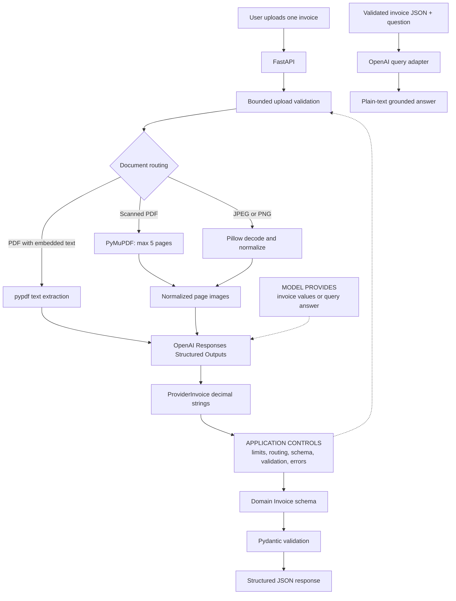

# Extraction Agent

An invoice-extraction service that turns PDFs and images into validated,
application-owned JSON. The system combines bounded document processing, text-first
routing, OpenAI Structured Outputs, and final Pydantic validation behind a FastAPI
API.

- **Live demo:** <https://marvinjb.dev/demo/extraction>
- **Public production service:** <https://api.marvinjb.dev>
- **Runtime:** Python 3.12, FastAPI, OpenAI Responses API, Pydantic, pypdf,
  PyMuPDF, Pillow, Docker

## What the system does

Users upload one synthetic/sample invoice as a PDF, JPEG, or PNG. Readable PDFs
stay on an embedded-text path; image invoices and scanned PDFs use bounded vision
processing. Both paths return the same strict `Invoice` response with nullable
source facts, exact decimal amounts, line items, and warnings. A second endpoint
answers one question using only a previously validated invoice JSON object.

This is more than "send a file to an LLM": the application owns the upload
limits, media/signature checks, decoded-image and page bounds, routing, output
schema, final validation, error mapping, and privacy-safe telemetry.

## End-to-end workflow

1. FastAPI accepts one multipart `file` and reads at most 5 MiB plus one byte.
2. The application checks declared media type, file signature, and non-empty size.
3. Text PDFs are parsed with pypdf.
4. PDFs without embedded text are rendered with PyMuPDF, at most five pages.
5. JPEG/PNG uploads are decoded with Pillow; images are limited to 20 megapixels
   and normalized to at most 2,000 pixels per side.
6. The OpenAI adapter requests the application-owned `Invoice` structure.
7. Pydantic validates the returned value again and rejects unknown fields.
8. FastAPI returns JSON or a bounded, mapped error response.

## Architecture



The text-first path avoids vision cost and latency when a PDF already has useful
text. Vision is the fallback for pixels; pypdf is not OCR. See
[Architecture](docs/ARCHITECTURE.md) for the component and deployment boundaries.

## Structured output and trust boundary

### The application enforces

- A 5 MiB application read boundary and supported PDF/JPEG/PNG declarations.
- Matching leading signatures, parser/decoder checks, and image/page limits.
- Text-versus-vision routing.
- An application-owned provider DTO with plain decimal strings, followed by
  deterministic `Decimal` conversion and the authoritative domain `Invoice` schema.
- Three-letter uppercase currency codes, valid dates, finite decimals, required
  line-item descriptions, and forbidden unknown fields.
- Explicit HTTP error mapping and application-generated request IDs.

### The application does not prove

- That every extracted value is factually correct or complete.
- That totals reconcile or line-item arithmetic is correct.
- That every missing or ambiguous value receives a warning.
- Semantic accuracy, source-coordinate citations, or hallucination-free output.

Schema validity is necessary for reliable API integration; it is not an accuracy
score. The service intentionally does not invent a numeric confidence value.

## Synthetic input/output example

Given a clearly synthetic invoice containing `Acme Supplies`, invoice `INV-1001`,
and a total of `108.25 USD`, a representative response is:

```json
{
  "vendor": "Acme Supplies",
  "invoice_number": "INV-1001",
  "invoice_date": "2026-08-20",
  "currency": "USD",
  "subtotal": "100.00",
  "tax": "8.25",
  "total": "108.25",
  "line_items": [],
  "warnings": []
}
```

The example documents the contract; it is not a measured production result.

## File safety and privacy

Uploads are processed within one request and the application does not intentionally
persist documents or extraction history. Multipart handling may use framework or
operating-system temporary spooling. The following data crosses the provider
boundary:

- **Text PDF:** extracted document text is sent to OpenAI.
- **Scanned PDF or image:** normalized images/pages are sent to OpenAI.
- **Invoice query:** validated invoice JSON and the user's question are sent to
  OpenAI.

Do not upload sensitive documents unless organizational and provider policy permits
it. Prefer synthetic/sample invoices for this public portfolio demo. The repository
makes no claim about provider retention policy.

## Evaluation and testing

The offline suite uses fakes and makes no paid provider calls. It covers upload
safety, PDF/image processing, text/vision routing, schema behavior, provider failure
mapping, the API, CORS, request IDs, and privacy-safe logs. It includes encrypted
and empty PDFs, malformed documents, multi-frame images, decoded-pixel limits,
normalization, and scanned-PDF page limits.

There is **no scored extraction-accuracy benchmark**. No precision, recall,
exact-match, field-accuracy, or hallucination-rate claim is made. A meaningful
quality benchmark requires a sanitized/synthetic labeled invoice set. See
[Evaluation](docs/EVALUATION.md).

## Deployment

The backend is deployed behind `api.marvinjb.dev`; the portfolio UI is hosted at
`marvinjb.dev`. The production artifact is a digest-pinned, multi-stage Python 3.12
image running as a non-root user. Uvicorn listens on container port 8000 and Docker
checks `GET /health`. Secrets enter only at runtime.

The repository does not contain VPS credentials, Nginx configuration, or a claimed
automated deployment system. See [Deployment](docs/DEPLOYMENT.md) for the verified
container boundary and conservative release procedure.

## API overview

| Method | Path | Purpose |
| --- | --- | --- |
| `GET` | `/health` | Process health check |
| `POST` | `/extractions/invoice` | Extract one multipart invoice |
| `POST` | `/extractions/invoice/query` | Ask one question about validated invoice JSON |

Swagger UI, ReDoc, and OpenAPI remain enabled at FastAPI's default paths. Full
requests, schemas, and error mappings are in [API documentation](docs/API.md).

## Local development

Requirements: Git, Python 3.12, and optionally Docker.

```bash
git clone https://github.com/marvinjbb/extraction-agent.git
cd extraction-agent
python -m venv .venv
```

Activate the environment (`.venv\Scripts\Activate.ps1` on PowerShell or
`source .venv/bin/activate` on macOS/Linux), then install the reproducible set:

```bash
python -m pip install --constraint requirements.lock -e ".[dev]"
```

Copy `.env.example` to the ignored `.env`, provide `OPENAI_API_KEY` only for real
provider use, and start the API:

```bash
python -m uvicorn app.main:app --reload
```

Normal tests do not need a key:

```bash
pytest
ruff check .
ruff format --check .
python -m pip check
```

To update dependencies, deliberately update compatible ranges in `pyproject.toml`,
resolve/test the environment, regenerate exact versions in `requirements.lock`, and
run the complete verification matrix before review.

## Docker

```bash
docker build --tag extraction-agent:local .
docker run --rm --env-file .env --publish 8000:8000 extraction-agent:local
```

The image installs the same locked runtime dependency set used by CI. The key is a
runtime environment value, not a build argument or image layer.

## Observability

The service emits allowlisted JSON events for request completion, safe upload
categories, selected extraction path, provider duration/outcome, and safe failure
categories. Each response has an application-generated `X-Request-ID`; caller IDs
are not trusted. Logs intentionally exclude document contents, extracted fields,
filenames, questions, prompts, raw provider responses, image data, cookies, sensitive
headers, and credentials.

## Known limitations

- Invoice-only schema; one file per request; no batch or async queue.
- No local OCR; image/scanned-PDF extraction requires provider vision.
- Scanned PDFs are limited to five pages; files to a 5 MiB application read limit;
  images to 20 megapixels and 2,000 pixels per side after normalization.
- Mixed-content PDFs with any extractable text stay on the text path.
- PDF text order can differ from visual layout.
- No page/coordinate citations, arithmetic reconciliation, human review, history,
  persistence, authentication, or application-level rate limiting.
- OpenAPI/Swagger are currently public and require a separate hardening review.
- No formal accuracy benchmark; schema validity is not factual correctness.
- Availability, latency, privacy, and quality depend partly on the provider.
- Endpoint-level reading does not reject an oversized multipart body before the
  framework parses it; ingress/body-size enforcement is still important.

## Documentation

- [Architecture](docs/ARCHITECTURE.md)
- [Evaluation](docs/EVALUATION.md)
- [API](docs/API.md)
- [Deployment](docs/DEPLOYMENT.md)
- [Lessons learned](docs/LESSONS_LEARNED.md)
- [Roadmap](docs/ROADMAP.md)
- [Architecture decisions](docs/DECISIONS.md)
- [Security](SECURITY.md)
- [Contributing](CONTRIBUTING.md)

## Lessons learned

The central lesson is that reliable extraction comes from explicit boundaries:
parsing is separate from inference, provider output is not trusted merely because
it is structured, and file support expands the safety surface. The concise project
history is in [Lessons learned](docs/LESSONS_LEARNED.md).
