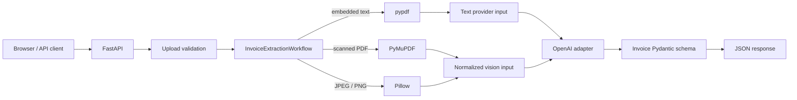
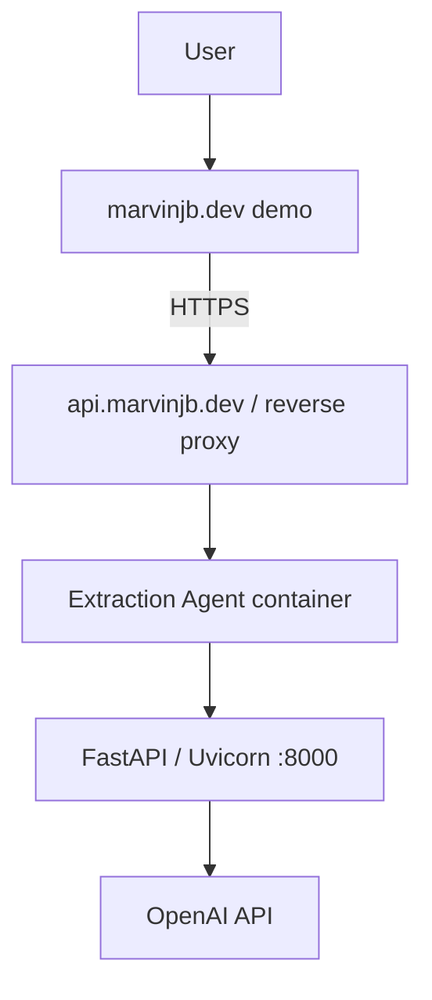

# Architecture

## System boundary

Extraction Agent is a stateless FastAPI service for one invoice at a time. It owns
HTTP validation, document routing, parser/image safety controls, the invoice schema,
local output validation, error mapping, and safe telemetry. OpenAI provides field
extraction or a grounded query answer through adapters isolated from the routes.

## Upload lifecycle and validation boundary

`POST /extractions/invoice` accepts a multipart field named `file`. The application:

1. maps the declared content type to PDF, JPEG, or PNG;
2. reads no more than 5 MiB plus one byte;
3. rejects empty or oversized content;
4. checks the corresponding `%PDF-`, JPEG, or PNG signature;
5. passes immutable bytes plus a normalized media type to the workflow.

These checks catch common mistakes and impose a cost boundary. They do not prove a
document is benign or structurally valid; parser/decoder validation remains a
separate layer. Framework multipart handling can spool temporary content before the
endpoint performs its bounded read, so a reverse proxy should also enforce a body
limit.

## Embedded-text PDF path

pypdf reads validated bytes in memory, rejects encrypted/malformed PDFs, extracts
embedded text per page, trims it, and joins readable pages in order. If useful text
exists, only that text is sent to the extraction provider.

Text-first routing avoids rendering and transmitting page images when the PDF
already exposes its content. That reduces provider cost, payload size, and latency.
It does not reconstruct visual table structure, and PDF extraction order may differ
from the visible page.

## Image and scanned-PDF path

When pypdf finds no embedded text, the workflow treats the PDF as scanned and uses
PyMuPDF to render at most five pages. Empty, encrypted, unreadable, and longer PDFs
are rejected. Each rendered page is bounded to 2,000 pixels on its longest side.

Direct JPEG/PNG uploads are decoded with Pillow. The decoder verifies the declared
format, rejects unreadable or multi-frame images and content above 20 megapixels,
applies EXIF orientation, converts to RGB, and creates a JPEG of at most 2,000 pixels
per side. Normalized pages/images are then sent as vision input.

pypdf is not OCR. Vision fallback is required because scanned PDFs contain pixels,
not useful embedded text. A local OCR engine was deliberately not added: it would
introduce binaries and a second recognition/evaluation problem without a current
requirement.

## Provider and validation boundaries

`InvoiceExtractor`, `VisionInvoiceExtractor`, and `InvoiceQueryService` are
application-owned protocols. OpenAI SDK calls live only in their adapters, so route
tests use fakes and provider replacement remains localized.

The extraction adapter uses the Responses API with native Structured Outputs based
on `ProviderInvoice`. Its monetary and quantity values are constrained plain decimal
strings. Application code converts those strings with `decimal.Decimal`, then the
authoritative domain `Invoice` validates the complete result. This separates provider
schema compatibility from domain precision. The domain contract:

- forbids unknown fields;
- represents monetary/quantity values as finite `Decimal` values;
- validates ISO dates and uppercase three-letter currency codes;
- requires a non-empty line-item description;
- permits nullable source facts and independent empty collections.

Structured Outputs reduce format errors. Final Pydantic validation makes the
application contract authoritative even if SDK behavior changes. Neither mechanism
proves the model copied the correct fact from the source.

## Error mapping

Document/parser/image failures become 422 responses. Missing provider configuration
maps to 503, provider timeouts to 504, and provider or invalid-output failures to
502. Upload boundary failures remain 400, 413, or 415. FastAPI request-schema errors
also use 422. Responses keep FastAPI's standard `detail` shape.

## Invoice query endpoint

`POST /extractions/invoice/query` accepts a non-empty question (maximum 500
characters) and a complete Pydantic-valid `Invoice`. The adapter serializes that
invoice plus the question as direct provider context and requests a concise plain-
text answer. It does not resend the original document, preserve conversation state,
or retrieve external content.

RAG is unnecessary here: the entire relevant object is already small, structured,
and present in the request. The endpoint remains model-grounded by instruction, not
mathematically guaranteed against every unsupported statement.

## Transient processing and privacy

The application stores no document, result, user, or conversation history and has
no database. Upload bytes live for the request, though multipart/framework or OS
temporary spooling may occur.

- Text PDF path sends extracted text to OpenAI.
- Image/scanned path sends normalized images/pages to OpenAI.
- Query path sends validated invoice JSON and the user's question to OpenAI.

Telemetry is allowlisted and never includes those payloads, filenames, extracted
fields, prompts, raw provider bodies, credentials, cookies, or sensitive headers.

## Observability

HTTP middleware creates a new opaque request ID for every request, exposes it as
`X-Request-ID`, and logs route/status/duration. Application layers emit JSON events
for upload categories, chosen extraction path, provider outcome/duration, and safe
failure classification. A `ContextVar` correlates events without accepting a
caller-supplied identifier as authoritative.

## Deployment topology

The multi-stage Dockerfile builds locked wheels, installs runtime dependencies in a
digest-pinned Python 3.12 slim image, creates a non-root `app` user, exposes internal
port 8000, and checks `/health`. Configuration and secrets enter at runtime. The
repository intentionally contains no database, Redis, vector store, object store,
queue, local OCR, Nginx configuration, or deployment credential.
